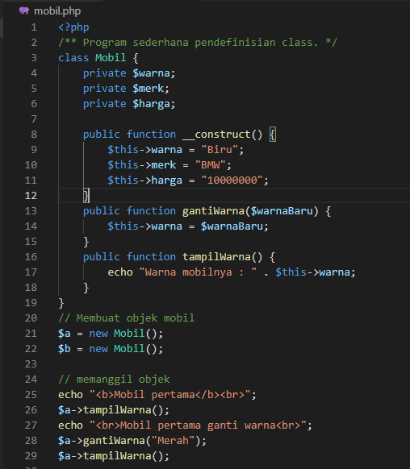
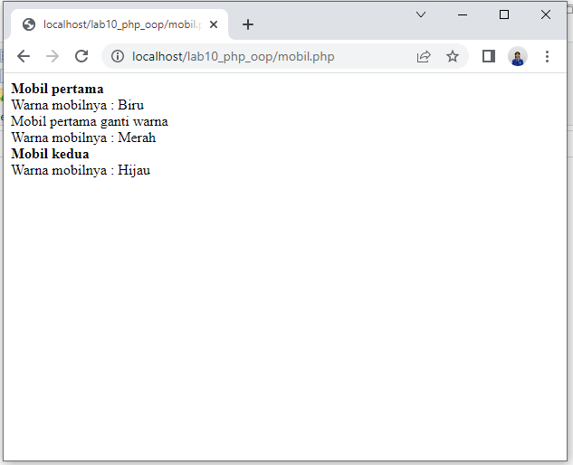
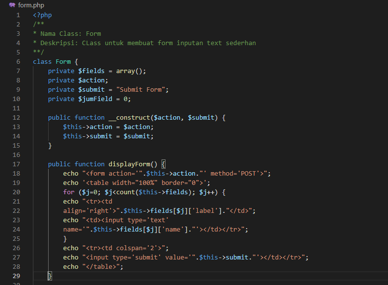
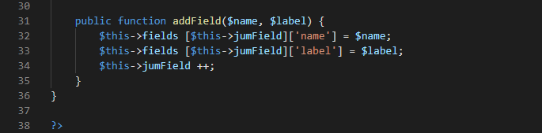
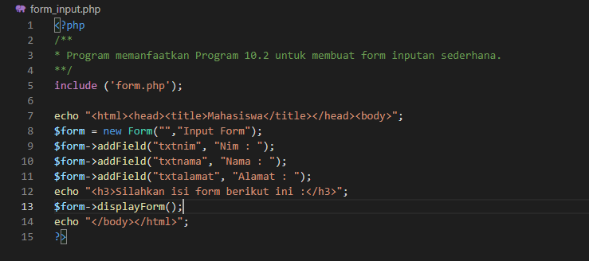

Nama : Rahmat

NIM : 312010229

Kelas : TI.20.A.2

# Lab10Web

## PHP OOP

Buat file baru dengan nama **mobil.php**

Dan ini kodenya

Ini tampilannya di browser

Buat file baru dengan nama **form.php**

Dan ini kodenya

Dan buat file baru dengan nama **form_input.php**

Ini tampilannya di browser

